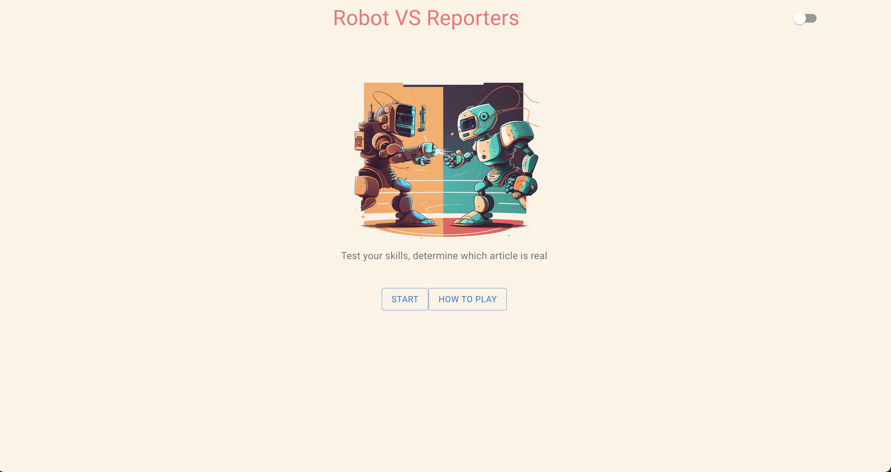
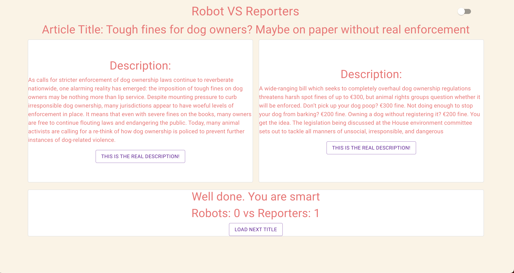
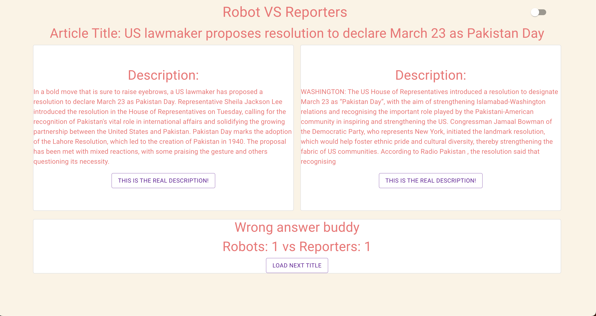

# Robots Vs Reporters

## Description
Web application to determine which article description is written by a real journalist vs ChatGPT. The app pulls a news title and description from NewsData.io API, which is then displayed to the screen. After the news title is pulled, ChatGPT API is called to write an article description based on the title given. The user will then have to decide which one is real. Scoring system allows for users to track if they can determine which one is real across the whole game. 

## Features
- Functional components using React
- ChatGPT API & NewsData.io API
- Sleek design, with loading screen to allow time for ChatGPT call
- Handling JSON data

## Photos
Homepage: 

Question 1: 

Question 2: 

## Usage 
Run the website, click on how to play, and press the start button. 

## Deployed Site
https://robotvsreporters.netlify.app/

## Contributors
Sebastian Jones : https://github.com/sebastianj0nes
 
Stuart Lansdowne : https://github.com/stuart540
 
Rai, Wai Man Tse : https://github.com/ra724619
 
Sam Callaway : https://github.com/Sam-Callaway